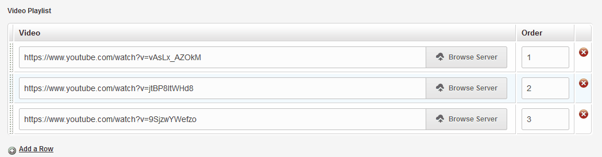

# repeatable

## Events

## _reorder
```html
<cms:template title='Airtame' >
    <cms:config_form_view>
        <cms:script>
            (function($){
                $(".k___repeatable > .repeatable-region.tableholder > table.rr tbody").each(function(i, el){
                    $(el).bind( '_reorder', function(){
                        $(this).find('tr').each( function() {
                            var input = $(this).find('input[id^="f_content_video-"][id$="-order"]');
                            $(input).get(0).value = $(this).get(0).rowIndex;
                        })
                    });
                });
            })(jQuery);
        </cms:script>
    </cms:config_form_view>
</cms:template>
<cms:repeatable name='content_video' label='Video Playlist'>
    <cms:editable type='file' name='video' label='Video' input_width='850' />
    <cms:editable type='text' name='order' label='Order' col_width='100' input_width='20' />
</cms:repeatable>
```

