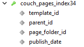

# SQL

## limited pages

```sql
SELECT p.id, p.template_id
FROM couch_pages p
WHERE p.template_id='1' AND p.publish_date < '2022-06-01 00:08:37'
AND NOT p.publish_date = '0000-00-00 00:00:00'
AND p.parent_id=0
ORDER BY p.publish_date DESC
LIMIT 0, 1000
```

#### Index 34



```html
<cms:test
    ignore='0'
>
    <cms:pages
        return_sql='1'
        paginate='1'
        limit='10'
        skip_custom_fields='1'
    >

    </cms:pages>
</cms:test>
```

## less filters


```sql
SELECT p.id, p.template_id
FROM couch_pages p
WHERE p.template_id='1'
AND p.parent_id=0
ORDER BY p.publish_date DESC
LIMIT 0, 1000
```
#### Index 25


```html
<cms:test
    ignore='0'
>
    <cms:pages
        return_sql='1'
        paginate='1'
        limit='0'
        skip_custom_fields='1'
        show_future_entries='1'
        show_unpublished='1'
    >

    </cms:pages>
</cms:test>
```
