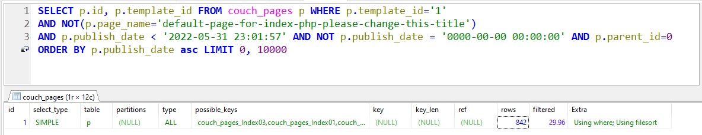
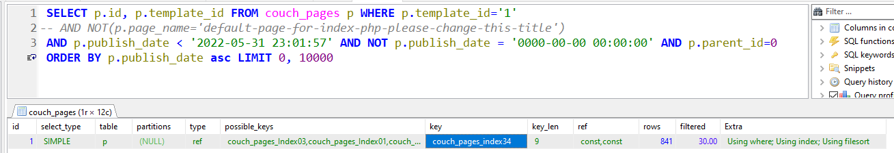
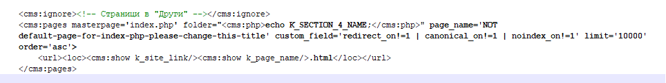

# pages

## Filter default page

### code
```html
<cms:pages masterpage='index.php'
    page_name='NOT default-page-for-index-php-please-change-this-title'
    limit='10000'
    order='asc'
    return_sql='0'
    >
    <url><loc><cms:show k_site_link/><cms:show k_page_name/>.html</loc></url>
</cms:pages>
```
### problem

No key, no index! Not good.. &mdash;



This one's much better! &mdash;



Original query is even more complicated &mdash;



### Solution

```html
<cms:pages masterpage='index.php'
    limit='10000'
    order='asc'
    return_sql='0'
    >
    <cms:if "<cms:not k_page_name = 'default-page-for-index-php-please-change-this-title' > />" >
    <url><loc><cms:show k_site_link/><cms:show k_page_name/>.html</loc></url>
    </cms:if>
</cms:pages>
```
Do not task database with simple checks! Move them in the code block.

